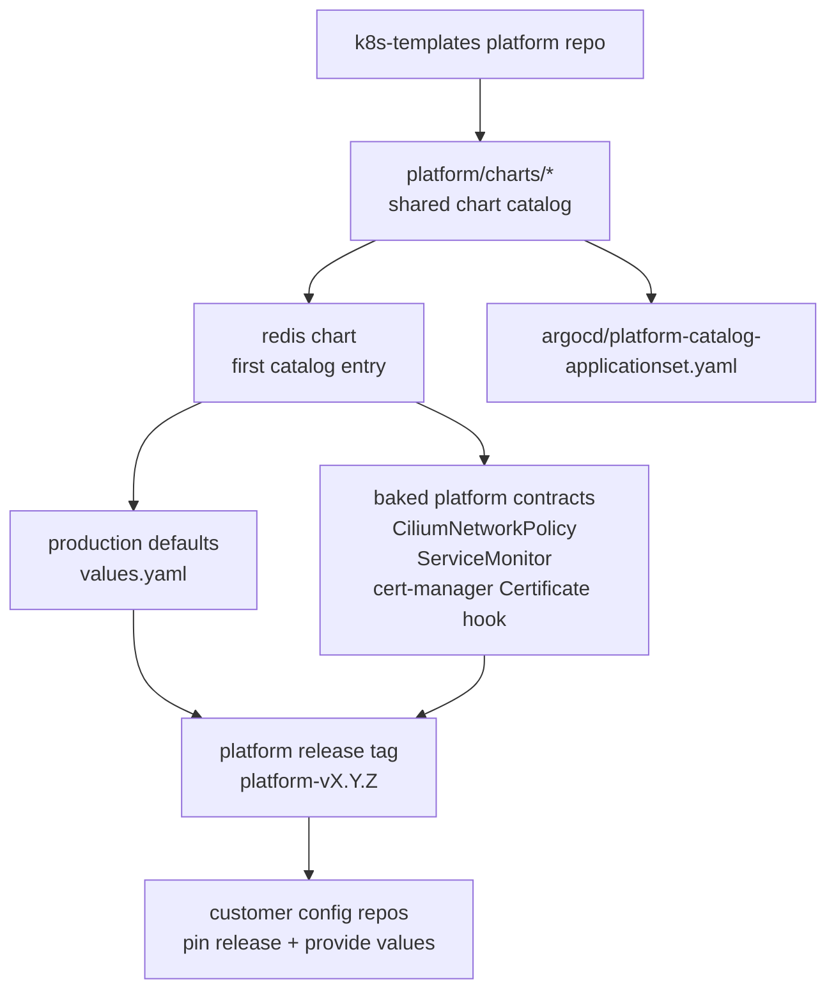

# Platform Catalog

The platform catalog is the shared chart layer that customer config repos consume
through platform release tags.

The design follows the useful part of KubeAid's model: a curated platform
baseline lives in one place, while each customer repo supplies only the small set
of environment inputs needed to run that baseline. Fixes should move through
platform chart releases and version bumps, not through copied manifests in every
customer repo.

Charts live under `platform/charts/`. Each catalog chart should carry the same
operational contracts:

- production-tested default values in `values.yaml`
- Cilium NetworkPolicies enabled by default
- Prometheus ServiceMonitors pre-wired by default
- cert-manager resources or annotations selected from TLS values
- local scenario overrides under `gitops/catalog-values/` only when the local
  kind cluster lacks an optional CRD or cloud integration

## Current Catalog Entries

| Chart | Purpose | Baked Defaults |
| --- | --- | --- |
| `redis` | In-cluster Redis dependency for Temporal scenarios | CiliumNetworkPolicy, ServiceMonitor, cert-manager Certificate hook |

The local kind scenario disables Redis `ServiceMonitor` through
`gitops/catalog-values/redis-local.yaml` until a monitoring stack is added to the
cluster. The chart default still renders the ServiceMonitor so platform releases
carry the production observability contract.

## Platform Repo Diagram



## Adding Charts

New platform charts should follow the Redis layout:

```text
platform/charts/<name>/
  Chart.yaml
  values.yaml
  templates/
```

After adding a chart, render both default and local override values from
`scripts/validate.sh`, then add the chart to
`argocd/platform-catalog-applicationset.yaml`.

`scripts/validate-platform-catalog.sh` enforces the shared chart contract. Every
platform chart must render a `CiliumNetworkPolicy`, a `ServiceMonitor`, and a
cert-manager `Certificate` with issuer annotations when TLS is enabled.
